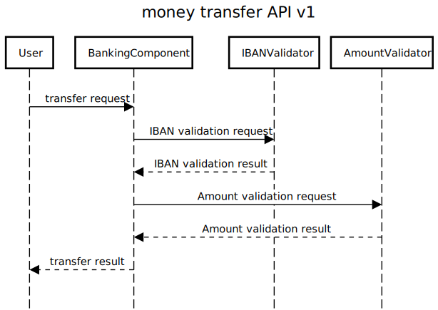

# InteractionTestExample

## The project

This project is meant for demonstration purposes. It shows how [InterACt](https://github.com/NilsWild/InterACt) can be
used to test the integration of component-based software systems.
It consists of three components:

- BankingComponent
- IbanValidator
- BlacklistChecker

Each of these components is implemented using Spring-Boot. The BankingComponent takes transfer requests and uses
the other two components to validate the transfer request.
Two different flows were implemented. The v1 API calls the IbanValidator and BlacklistChecker one after the other,
whereas the v2 API calls the IbanValidator which calls the BlacklistChecker in return. This can be seen in the sequence
diagrams below:

## The tests

For each of the two flows, tests are provided on the component level. The tests use mocks to test the functionality of
each component in isolation.
Utilizing InterACt these tests are observed and the observed data is stored such that InterACt can analyze these
observations and retrieve interaction expectations from that data.
Tests for positive as well as negative testing are provided.

## Interaction testing with InterACt

To run interaction test you need to follow these steps:

- Install and start InterACt
- Run each Unit-Test suite once
- Re-execute the tests until all interaction expectations are validated

## Detecting integration faults

You can manipulate components and their tests such that the expectation of a component do not comply with the provided
implementation of the other components.
E.g. change the regular expression in the IbanValidatorController such that it only accepts non formatted IBANs.
